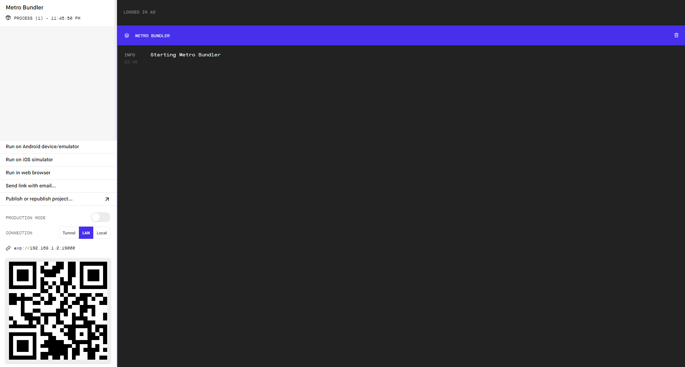

# Robot Controller 

## Overview

This project is a react native app that sends command to a robot.

It has several different commands:
* PLACE : this will place the robot in the given position
* MOVE : move the robot by 1 step (up, down, left, right)
* DETECT : detect if the current well under the robot is filled
* DROP : drop a liquid in the well under the robot
* REPORT : report the position and the status of the well the robot is currently on


## Installation

**Install `expo` ( if not yet installed )**

```
npm install expo-cli --global
```

**Install the npm dependencies**

```
npm install
```

**Open a simulator (can be an Android / iOS device)**

Open an Android or iOS simulator (by using Android Studio or XCode)

**Run the project**

```
npm run start
```

**Deploy to simulator**

A browser will popup showing expo dev tools



click `Run on Android` or `Run on iOS` depending on the simulator being used (can also run both)

Note: if it fails to load, try to click `Tunnel` before clicking run, this will change the way the app is being served

## Further improvement

Currently, there is no check for the `DROP` command. It will drop a liquid even if the well is already filled. For safety purpose,
we might need to implement a check first before dropping or create a double confirmation flow for user to confirm before doing a drop.

Implement automated unit testing and UI testing.

Connect with a backend, preferably using websocket for real-time action.